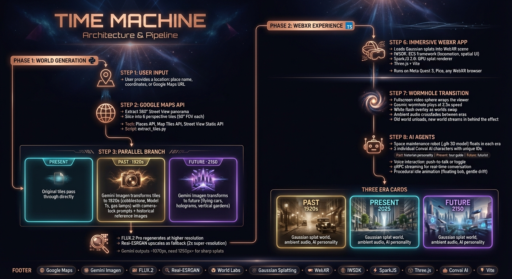
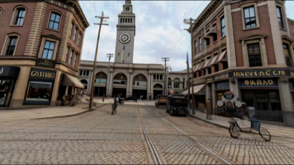
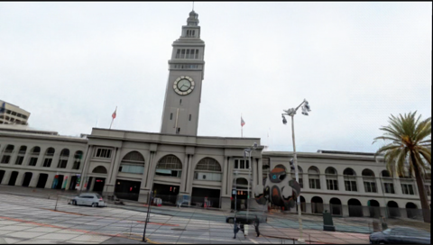
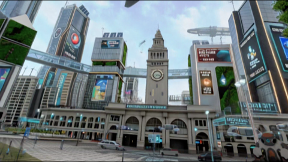
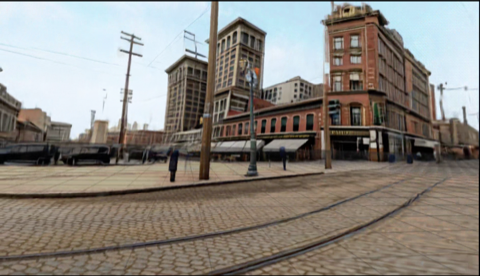
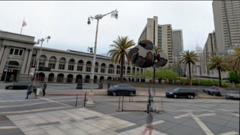
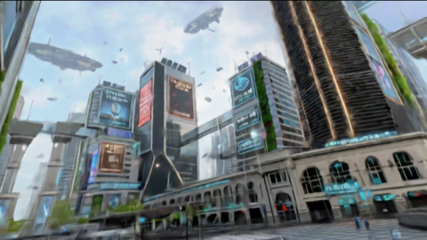

# Time Machine WebXR

Prompt any real-world location and travel through time — explore it in the 1920s, present day, and a speculative future, all in immersive WebXR. The pipeline extracts Google Street View tiles, transforms them across time periods using Gemini Imagen, upscales with FLUX.2, and generates navigable 3D Gaussian splat worlds via World Labs.

This demo focuses on the **San Francisco Ferry Building**.

Built for Meta Quest 3 and Pico headsets. Also works in any WebXR-capable browser with the included headset simulator.

## Demo

<video src="DEMO_TIMEMACHINE.mp4" controls width="100%"></video>
https://github.com/user-attachments/assets/a247df99-e190-49b6-b88a-6cc143cbf014


## Architecture



## Screenshots

| Past (1920s) | Present | Future (2150) |
|:---:|:---:|:---:|
|  |  |  |
|  |  |  |

## How It Works

Three Gaussian splat worlds (generated via [World Labs Marble](https://marble.worldlabs.ai/)) are loaded into a WebXR scene using [SparkJS](https://sparkjs.dev/) and [IWSDK](https://elixrjs.io/). A spatial UI panel lets you switch between eras with animated fly-in/fly-out transitions.

| Era | Description |
|-----|-------------|
| **1920s** | Cobblestone streets, Model Ts, gas lamps, hand-painted storefronts |
| **Present** | San Francisco Ferry Building as it looks today |
| **Future** | Flying vehicles, holographic displays, vertical gardens, smart roads |

## Quick Start

```bash
git clone git@github.com:chloepilonv/timemachine_webxr.git
cd timemachine_webxr
npm install
```

### Asset Setup

The Gaussian splat files are too large for git (~20-30 MB each). Download them into `public/splats/` before running.

1. Open each world in your browser:
   - **Present**: https://marble.worldlabs.ai/world/11223fe8-f431-41d6-9fe2-9bc277ddab0c
   - **Past (1920s)**: https://marble.worldlabs.ai/world/ed9e8428-e599-482c-a4c9-d77abb834d96
   - **Future**: https://marble.worldlabs.ai/world/5b917cba-1247-4287-8613-5a199e74d7da
2. Click the download/export button on each world (SPZ format, OpenGL coordinates, Ground level)
3. Rename and move:

```bash
cp "San Francisco Ferry Building Scene.spz" public/splats/present.spz
cp "San Francisco Ferry Building Scene_collider.glb" public/splats/present-collider.glb
cp "Historic City Street Clock Tower.spz" public/splats/past.spz
cp "Futuristic San Francisco Plaza.spz" public/splats/future.spz
```

Download `wormhole.mp4` from the [Google Drive assets folder](https://drive.google.com/drive/u/0/folders/1I-vMTyBWYTMFmflAM35rkJLRSXnFFczE) and place it in `public/`.

### Run

```bash
npm run dev
```

Opens at `https://localhost:8081/`.

### HTTPS Setup

WebXR requires HTTPS on non-localhost origins. The dev server uses local certs via [mkcert](https://github.com/FiloSottile/mkcert):

```bash
brew install mkcert
mkcert -install
mkcert -key-file .key.pem -cert-file .cert.pem localhost 127.0.0.1 $(ipconfig getifaddr en0) 0.0.0.0
```

## Controls

### VR Controls (Quest 3 / Pico)

| Button | Action |
|--------|--------|
| **A** (right) | Next era |
| **B** (right) | Previous era |
| **X** (left) | Toggle talk to AI agent |
| **Grip/Squeeze** (either) | Push-to-talk (hold) |
| **Trigger** | Select / interact |
| **Thumbstick** | Teleport locomotion |

## World Generation Pipeline

```
Location (URL / coords / place name)
        |
        v
 [1] extract_tiles.py  -->  tiles_present/   (6 perspective tiles from Street View)
        |
        v
 [2a] generate_past.py   -->  tiles_past/    (1920s via Gemini)
 [2b] generate_future.py -->  tiles_future/  (2150 via Gemini)
        |
        v
 [3] create_world.py  -->  World Labs 3D world (navigable Gaussian splat)
```

### Setup

```bash
pip install httpx python-dotenv pillow
```

Create a `.env` file:
```
GOOGLE_API_KEY=...      # Places API + Map Tiles API + Street View
GEMINI_API_KEY=...      # Gemini 3 Pro (image editing)
WORLDLABS_API_KEY=...   # World Labs Marble API
```

### Usage

```bash
python scripts/extract_tiles.py "Ferry Building, San Francisco" --tiles 6
python scripts/generate_past.py
python scripts/generate_future.py
python scripts/create_world.py image tiles_future/future_tile1_ferry_front.png
```

## Built With

- [IWSDK](https://elixrjs.io/) — WebXR ECS framework
- [SparkJS 2.0](https://sparkjs.dev/) — Gaussian splat renderer
- [World Labs Marble](https://marble.worldlabs.ai/) — AI-generated 3D worlds from images
- [Convai](https://convai.com/) — Voice AI agent
- [Vite](https://vite.dev/) — Build tooling

## Related

- [sensai-webxr-worldmodels](https://github.com/V4C38/sensai-webxr-worldmodels) — Original template
